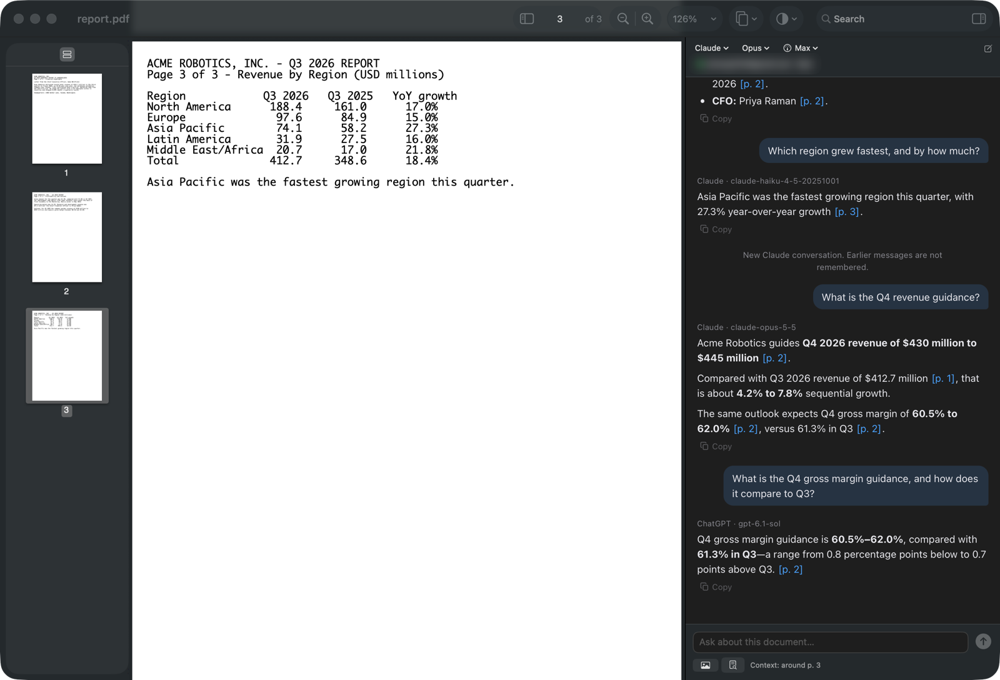

# Lectern



Lectern is a PDF reader for macOS with a chat pane next to the page. In the chat pane, you can ask Claude or ChatGPT
about the PDF. Lectern uses your Claude and ChatGPT plans. It sends your questions through the command-line tools
(CLIs) from Anthropic and OpenAI: Claude Code for Claude and Codex for ChatGPT.

The answers have page citations, for example `[p. 12]`. Each citation is a link to its page. For each PDF, Lectern
keeps one conversation with each provider.

## Before you start

- **Not from Anthropic or OpenAI.** Lectern is an open-source project of one person. Anthropic and OpenAI did not make
  Lectern, and they do not give money to the project.
- **Your plans.** Each message uses part of the usage limits of your plan. Lectern is for personal, non-commercial use
  of your plans. Read the terms of your plans before you use Lectern.
- **No credentials in Lectern.** Lectern never reads, keeps or sends your passwords, tokens or API keys. The CLIs keep
  your sign-ins.
- **No server.** Lectern has no server, no analytics and no telemetry. It sends your questions and the text of the
  PDF only to the provider that you use.
- **Read-only.** Lectern never changes your PDFs.

This README has a CAUTION notice. Read the CAUTION before you do the step that follows it.

The [Lectern guide](docs/GUIDE.md) has all the procedures and details.

## Necessary items

| Item | What is necessary |
| --- | --- |
| Mac | A Mac with Apple Silicon and macOS 14 or later. |
| For Claude | A Claude plan with Claude Code (for example Pro or Max), and Claude Code on your Mac. |
| For ChatGPT | A ChatGPT plan with Codex, and the ChatGPT desktop app or the Codex CLI from npm. |

### Install the CLIs

Install only the CLIs for the providers that you use.

To run a command, type it in Terminal (Applications > Utilities > Terminal). Then press Return.

1. If Lectern is open, quit Lectern.
2. For Claude, run `curl -fsSL https://claude.ai/install.sh | bash`.
3. For ChatGPT, install the [ChatGPT desktop app](https://openai.com/chatgpt/desktop/). You can also run
   `npm i -g @openai/codex`.

For other methods, refer to [Install the CLIs](docs/GUIDE.md#install-the-clis) in the guide.

## Install Lectern

### Option A: Download the app

1. Open the [Releases](https://github.com/yimeng-blake/lectern/releases) page.
2. Download `Lectern-<version>-arm64.zip`.
3. Optional: before you open the zip file, do a check of the download. Refer to
   [Option A](docs/GUIDE.md#option-a-download-the-app) in the guide.
4. Double-click the zip file. macOS puts `Lectern.app` in the same folder.
5. Move `Lectern.app` to your Applications folder.
6. Do the procedure in [Let macOS open Lectern](#let-macos-open-lectern).

### Let macOS open Lectern

Lectern does not have Apple notarization. Because of this, macOS does not let Lectern open the first time. After
macOS does not let Lectern open, System Settings shows **Open Anyway** for approximately one hour only.

On macOS 15 and later, do these steps:

1. Open Lectern one time. macOS shows a dialog about Lectern.
2. Close the dialog. Do not move Lectern to the Trash.
3. Open **System Settings > Privacy & Security**.
4. In the **Security** section, click **Open Anyway** for Lectern.
5. When macOS asks for your password, type your password.

For macOS 14, and for a procedure in Terminal, refer to
[Let macOS open Lectern](docs/GUIDE.md#let-macos-open-lectern) in the guide.

### Option B: Build from source

1. If you do not have the Command Line Tools, run `xcode-select --install`.
2. Run these commands, one at a time:

   ```sh
   git clone https://github.com/yimeng-blake/lectern.git
   cd lectern
   bash scripts/build-app.sh --install
   ```

3. Open Lectern from the Applications folder in your home folder (`~/Applications`).

An app that you build on your Mac does not have the quarantine attribute. Because of this, macOS lets it open. For
more information about the build, refer to [Option B](docs/GUIDE.md#option-b-build-from-source) in the guide.

## First steps

### Open a PDF

1. Open Lectern. Lectern shows the Open panel.
2. If Lectern does not show the Open panel, select **File > Open…** (⌘O).
3. Select a PDF.
4. Click **Open**. Lectern opens the PDF in a new window.

You can also drag a PDF to the Lectern icon in the Dock. For all methods, refer to
[Open a PDF](docs/GUIDE.md#open-a-pdf) in the guide.

### Sign in to Claude

Claude uses the sign-in of Claude Code on your Mac. If you signed in to Claude Code in Terminal, no more steps are
necessary.

1. When the banner in the chat pane shows that you are signed out, click **Log in in Terminal**. Terminal opens.
2. Do the sign-in steps in Terminal.
3. Click the Lectern window. Lectern finds the new sign-in automatically.
4. If the banner continues to show that you are signed out, click **Check again**.

### Sign in to ChatGPT

In Isolated mode (the default), Lectern has a separate ChatGPT sign-in. This sign-in does not change the sign-in of
your Codex CLI or of the ChatGPT app. In Shared mode, Lectern uses the sign-in of your Codex CLI. To select a mode,
refer to [Select Isolated or Shared](docs/GUIDE.md#select-isolated-or-shared-chatgpt) in the guide.

> [!CAUTION]
> If your Codex CLI must keep its ChatGPT sign-in, do not sign in to ChatGPT in Lectern in Shared mode. In Shared
> mode, a ChatGPT sign-in in Lectern also changes the sign-in of your Codex CLI.

1. In the banner or in Settings > Accounts, click **Sign in with ChatGPT**. Lectern opens the ChatGPT sign-in page in
   your web browser.
2. Do the sign-in steps in the browser.

To sign in with a device code, refer to [Sign in to ChatGPT](docs/GUIDE.md#sign-in-to-chatgpt) in the guide.

### Ask a question

1. In the chat header, select Claude or ChatGPT in the provider picker.
2. Optional: mark text in the PDF. Lectern sends the marked text with your question.
3. Type your question in the message field at the bottom of the chat pane.
4. Press Return. Lectern sends the question with the current page (the page in the page box) and the pages near it.
5. To stop an answer, press ⌘. (Command-period).

For the other controls of the chat pane, refer to [Use the chat pane](docs/GUIDE.md#use-the-chat-pane) in the guide.

### Use a citation

1. Click a citation in the answer, for example `[p. 12]`. Lectern shows that page.
2. To go to the location before the jump, select **Go > Back** (⌘[).

### Change the appearance

1. In the toolbar, click the **Appearance** button (the circle that is half black).
2. Select **System**, **Light** or **Dark**.
3. To show the pages with inverted colors, select **Dark Pages**. The PDF file does not change.

## More information

The [Lectern guide](docs/GUIDE.md) gives more information about these items:

- [Keyboard shortcuts](docs/GUIDE.md#keyboard-shortcuts)
- [Settings](docs/GUIDE.md#settings)
- [Use the viewer](docs/GUIDE.md#use-the-viewer): pages, sidebar, zoom, search, print and appearance
- [Use the chat pane](docs/GUIDE.md#use-the-chat-pane): models, **Fast**, purchased credits and context
- [Privacy and usage](docs/GUIDE.md#privacy-and-usage)
- [Problems and remedies](docs/GUIDE.md#problems-and-remedies)
- [Install a new version or remove Lectern](docs/GUIDE.md#install-a-new-version-or-remove-lectern)

## For developers

Lectern is a Swift package for macOS 14 and later. For a debug build, run `swift build`.
[DESIGN.md](DESIGN.md) describes the architecture and the CLI protocols. For more commands and notes, refer to
[For developers](docs/GUIDE.md#for-developers) in the guide.

## License

Lectern uses the MIT license. Refer to [LICENSE](LICENSE). [THIRD_PARTY_NOTICES.md](THIRD_PARTY_NOTICES.md) gives the
list of third-party components in Lectern (marked and KaTeX).
